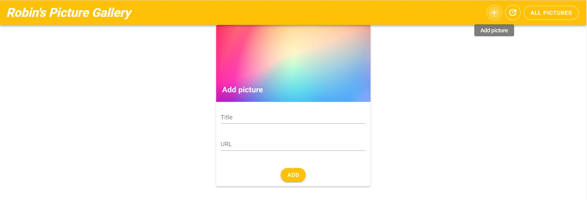

# Examenopdracht Januari 2021 - Image Pinboard by Robin Deleu

## Oprdacht

De volledige opdracht kan gevonden worden in [opdracht.md](opdracht.md) bestand voor alle info.

De applicatie bestaat uit 2 principiële delen. Een deel dat op de server uitgevoerd wordt, ook wel de
API of backend genoemd. Het andere deel wordt op de client in de browser uitgevoerd en wordt de
frontend genoemd.

### Backend

Bouw een REST API aan de hand van Node Express en TypeScript. De applicatie moet het mogelijk maken
om 'posts' te beheren. Een `post` bestaat uit volgende eigenschappen:

* uniek id
* URL
* titel (optioneel)
* tijdstip

De API moet het mogelijk maken alle CRUD acties uit te voeren. Dat wil zeggen dat de API via de
REST principes het mogelijk moet maken nieuwe posts toe te voegen, posts aan te passen, posts
uit te lezen en posts te verwijderen.

De gegevens die over de API uitgewisseld worden moeten opgebouwd worden aan de hand van JSON.

De gegevens moeten bijgehouden worden in een MySQL/MariaDB database. De REST API is verantwoordelijk
voor het correct opzetten van de nodige database, tabelstructuur (schema) en voor de verdere communicatie
die de verschillende CRUD acties mogelijk maakt.

### Frontend

De frontend bestaat uit een Vue.js 3 applicatie geschreven in TypeScript. De applicatie laat
een gebruiker toe met de REST API te interageren aan de hand van een overzichtelijke en gebruiksvriendelijke
webpagina.

De webpagina bevat 2 verschillende onderdelen: Een formulier dat de gebruiker toelaat een nieuwe URL
te posten. Daarnaast bevat de pagina ook een lijst met de verschillende geposte afbeeldingen. De URL
wordt door de webpagina gebruikt om de afbeelding te tonen.

De frontend kan gebruik maken van een CSS framework om stijl te geven aan de inhoud. Een verzorgde stijl
en weergave is gewenst.
, dan moeten standaard waarden gebruikt worden.
Gebruik hiervoor volgende waarden:

* Frontend:
  * Host: `localhost`
  * Port: `3000`
* Database:
  * Host: `localhost`
  * Port: `3306`
  * Username: `root`
  * Password: `` (leeg)

### `.gitignore`

Zorg dat enkel de nodige bestanden in Git beheerd worden. Bestanden die gevoelige informatie bevatten
of niet getracked moeten worden mogen niet opgenomen worden in Git. Maak hiervoor gebruik van een
correct `.gitignore` bestand.

### Backend

De backend moet gebouwd worden met Express en geschreven zijn in TypeScript.

Alle dependencies moeten beheerd worden in een `package.json` bestand en moeten
geïnstalleerd kunnen worden via een `npm install` commando.

Het uitvoeren van de server moet kunnen gebeuren via het `npm run` commando.

De backend moet opgebouwd zijn volgens de REST principes om de verschillende CRUD acties te implementeren.

De backend moet data kunnen verwerken in JSON formaat. Andere formaten of afwijkingen zijn niet toegestaan.

### Frontend

De frontend moet gebouwd worden met Vue 3 en geschreven zijn in TypeScript.

Alle dependencies moeten beheerd worden in een `package.json` bestand en moeten
geïnstalleerd kunnen worden via een `npm install`
commando.

Het uitvoeren van de server moet kunnen gebeuren via het `npm run` commando.

## Setting up the project

To setup the frontend you will need npm and/or Yarn.
To install all dependencies you must run these commands:

```bash
npm install
```

```bash
yarn install
```

Once you did this you can serve or build the frontend with following commands:

To serve:

```bash
yarn run serve
```

To serve with npm:

```bash
npm run start
```

To build:

```bash
yarn run build
```

To setup the backend you will need npm .
To install all dependencies you must run these commands:

```bash
npm install
```

To run the backend project use this command in the backend directory:

```bash
cd .\src\
ts-node .\server.ts
```

After this you must see this in the console.


To make sure you're backend and frontend work. Put the right configuration in the .env file.
The configuration for the .env files can be founded in the excercise.
For local use:

Backend
```bash
MYSQL_HOST=
MYSQL_USER=
MYSQL_PASSWORD=
MYSQL_PORT=
```

Frontend
```bash
VUE_APP_BACKEND_HOST=
VUE_APP_BACKEND_PORT=
```

## Usage

### Backend

The backend you can use all CRUD commands (Create, Read, Update, Delete).

#### Create
To create a record in the database you send a HTTP POST request that you must send to http://localhost:3000/api. The Request you must have a JSON body like for example:
```JSON
{	
"title": "castle",
"timepost": 1610702984482,
"url": "https://hips.hearstapps.com/hmg-prod.s3.amazonaws.com/images/bojnice-castle-1603142898.jpg"
}
```

#### Read
To read all record's in the database you send a HTTP Get request to http://localhost:3000/api. The Request don't have a body like. It will return an object like for example:
```JSON
[
  {
    "id": 8,
    "title": "Vue",
    "timepost": "1610707786633",
    "url": "https://upload.wikimedia.org/wikipedia/commons/thumb/9/95/Vue.js_Logo_2.svg/1200px-Vue.js_Logo_2.svg.png"
  },
  {
    "id": 7,
    "title": "castle",
    "timepost": "1610702984482",
    "url": "https://hips.hearstapps.com/hmg-prod.s3.amazonaws.com/images/bojnice-castle-1603142898.jpg"
  },
  {
    "id": 6,
    "title": "lion",
    "timepost": "1610702974482",
    "url": "https://media.s-bol.com/7v5E3vKoPpA/550x420.jpg"
  },
  {
    "id": 5,
    "title": "beach",
    "timepost": "1610702974382",
    "url": "https://retreatmi.com/files/destinations-logo/5e5224aa3718e.jpg"
  }
]
```

If you're intrested in 1 element just do a HTTP Get request to http://localhost:3000/api/IDNUMBER.

#### Update
This is the HTTP PUT request that you must send to http://localhost:3000/api/IDNUMBER. The Request must have a JSON body like for example:
```JSON
{	
  "title": "insomnia",
	"timepost": "20-jan-2021"
}
```

#### Delete
This is the HTTP DELETE request that you must send to http://localhost:3000/api/IDNUMBER. The Request must have no body.

### Frontend

The frontend have 3 page's, the main page, a page to add pictures to the wall and a page that updates the pictures.

#### Main Page

Here you see all posted pictures. You see a V-card for every picture. The V-card contain a title, timestamp and an unique id.
You also have a delete button, if you press the button you will delete the picture from the wall and out of the database from the backend.

This is a example how it could look:


#### Add Page

Here you can see to add a picture to the wall. Fill in the text fields (Title and URL). After that you press the add button. Then you will be redirectered to the main screen. You will see you're picture that you have added.

This is a example how it could look:



#### Update Page

Here you see can update a picture from the wall. Fill in the text fields (Title and id from the picture you want to update). After that you press the update button. Then you will be redirectered to the main screen. You will see the updates from the picture that you have updated.

This is a example how it could look:


## Authors

* **Robin Deleu** - *Student VIVES University of Applied Sciences*

## License

This project is licensed under the MIT License see the [LICENSE.md](LICENSE.md) file for details.
